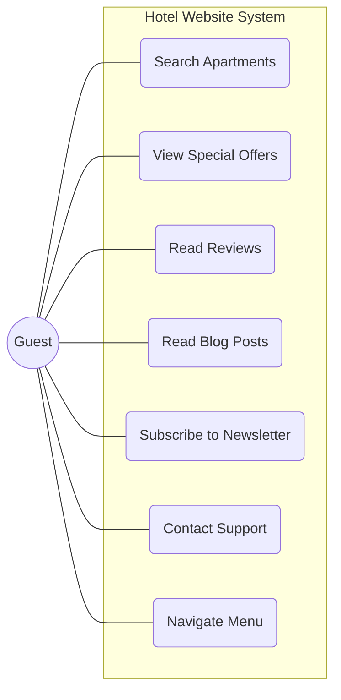

# Use Case Diagram

The following diagram illustrates the interactions between the Guest actor and the system's primary use cases.

```mermaid
graph LR
    Guest((Guest))

    subgraph "Hotel Website System"
        UC1(Search Apartments)
        UC2(View Special Offers)
        UC3(Read Reviews)
        UC4(Read Blog Posts)
        UC5(Subscribe to Newsletter)
        UC6(Contact Support)
        UC7(Navigate Menu)
    end

    Guest --- UC1
    Guest --- UC2
    Guest --- UC3
    Guest --- UC4
    Guest --- UC5
    Guest --- UC6
    Guest --- UC7
```
